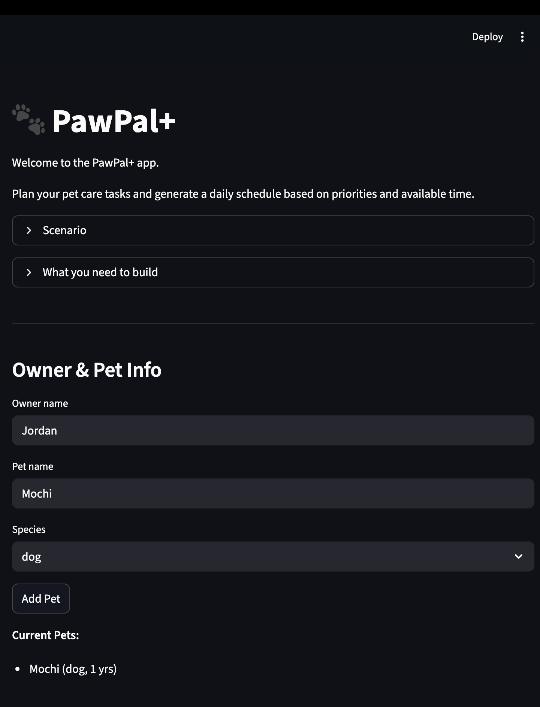
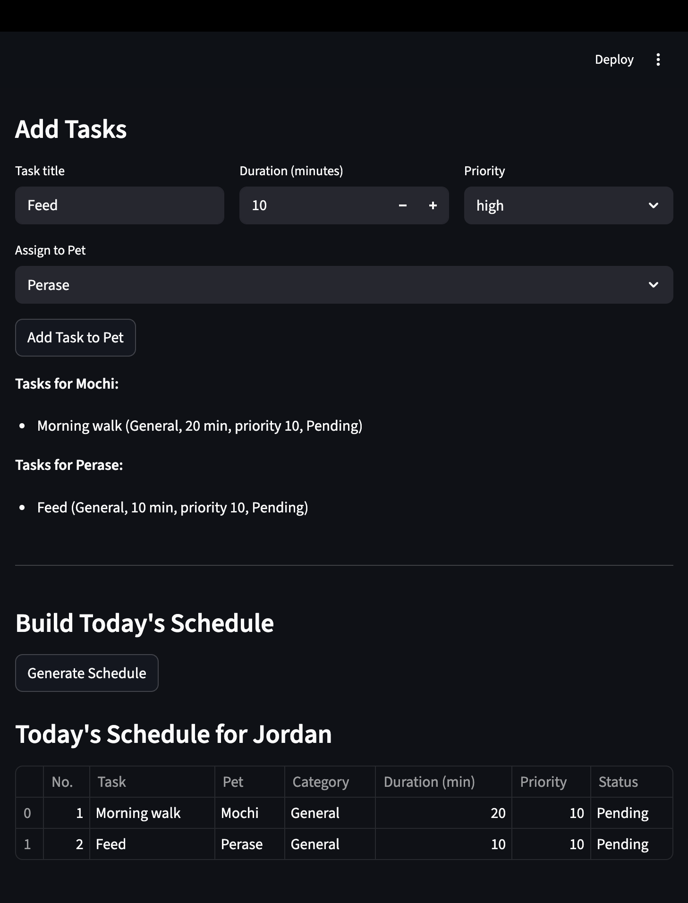

# PawPal+ (Module 2 Project)

You are building **PawPal+**, a Streamlit app that helps a pet owner plan care tasks for their pet.

## Scenario

A busy pet owner needs help staying consistent with pet care. They want an assistant that can:

- Track pet care tasks (walks, feeding, meds, enrichment, grooming, etc.)
- Consider constraints (time available, priority, owner preferences)
- Produce a daily plan and explain why it chose that plan

Your job is to design the system first (UML), then implement the logic in Python, then connect it to the Streamlit UI.

## What you will build

Your final app should:

- Let a user enter basic owner + pet info
- Let a user add/edit tasks (duration + priority at minimum)
- Generate a daily schedule/plan based on constraints and priorities
- Display the plan clearly (and ideally explain the reasoning)
- Include tests for the most important scheduling behaviors

## Getting started

### Setup

```bash
python -m venv .venv
source .venv/bin/activate  # Windows: .venv\Scripts\activate
pip install -r requirements.txt
```

### Suggested workflow

1. Read the scenario carefully and identify requirements and edge cases.
2. Draft a UML diagram (classes, attributes, methods, relationships).
3. Convert UML into Python class stubs (no logic yet).
4. Implement scheduling logic in small increments.
5. Add tests to verify key behaviors.
6. Connect your logic to the Streamlit UI in `app.py`.
7. Refine UML so it matches what you actually built.


### Smarter Scheduling
- Sort tasks by priority and time
- Filter tasks by pet or completion status
- Detect scheduling conflicts
- Automatically handle recurring tasks (daily/weekly)


## Features
- Add and manage multiple pets
- Add and manage tasks with priority, duration, and category
- Sort tasks by priority and time
- Filter tasks by pet or completion status
- Detect conflicts and display warnings
- Automatically handle recurring tasks (daily/weekly)


## Testing PawPal+

We wrote automated tests to ensure the PawPal+ system behaves correctly.

**How to run tests:**

python3 -m pytest


Confidence Level: ⭐⭐⭐⭐⭐ (5/5) — All core behaviors, including sorting, recurring tasks, and conflict detection, passed automated tests.

## Running the App

To launch the Streamlit interface:
streamlit run app.py


## 📸 Demo
<a href="/course_images/ai110/your_screenshot_name.png" target="_blank">
    
    
</a>